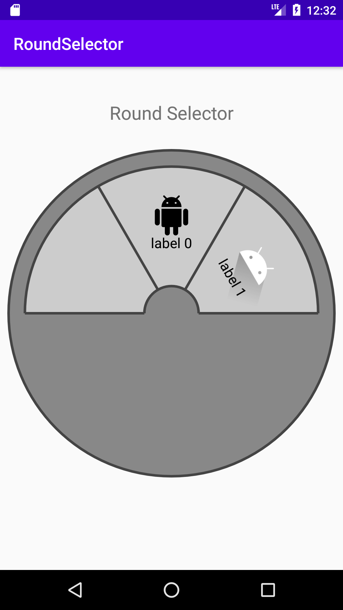
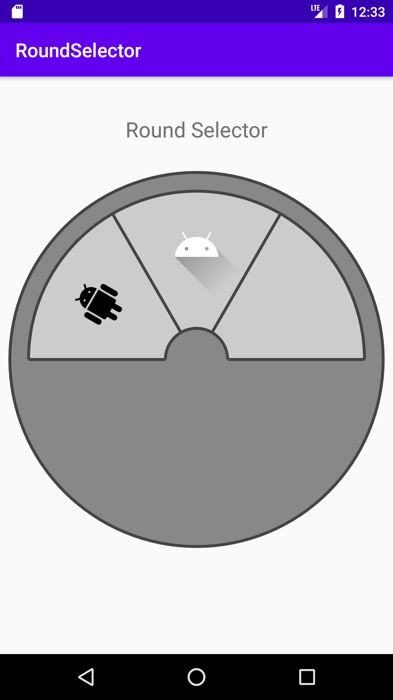

# Round Selector
Android custom view to display a list of items as a round selector




## Usage
Add `RoundSelector` into your activity
```xml
<ru.vigivn.roundselector.RoundSelector
        android:id="@+id/round_selector"
        android:layout_width="wrap_content"
        android:layout_height="wrap_content" />
```
Implement interface `IRoundSelectorItem`
```kotlin
class Item(
    private val label: String,
    private val drawable: Int
) : IRoundSelectorItem {
    override fun getLabel(): String = label
    override fun getDrawable(): Int = drawable
}
```
Add list of items to activity/fragment
```kotlin
    round_selector.items = listOf<Item>(
        Item("label 0", R.drawable.icon0),
        Item("label 1", R.drawable.icon1),
        Item("label 2", R.drawable.icon2),
        Item("label 3", R.drawable.icon3)
    )
```

## Docs
property|type|default value|description
-------:|:--:|:-----------:|-----------
items|List\<IRoundSelectorItem\>|empty list| list of items
currIndex|Int|0| index of current item in list
isLopped|Boolean|false| on/off looped items
showLabels|Boolean|true| show/hide item labels